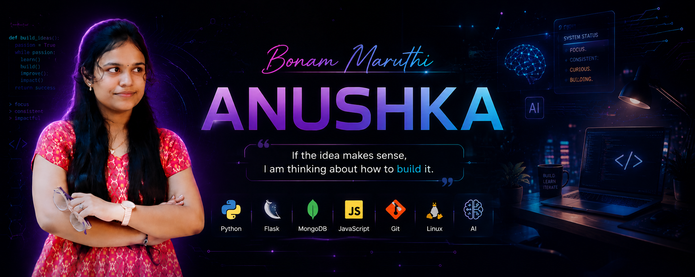
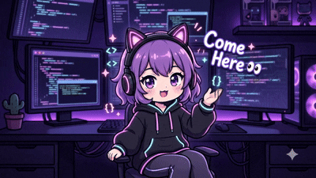

<!-- ===================== MAIN BANNER ===================== -->

  

 

<!-- ===================== WELCOME GIF ===================== -->

  

<!-- ===================== NAME SECTION ===================== -->

# ✨ Bonam Maruthi Anushka

  

<!-- ===================== COME HERE GIF ===================== -->

 

<!-- ===================== KNOW MORE BUTTON ===================== -->

  

<!-- ===================== SOCIAL ICONS ===================== -->

 

💡 *If the idea makes sense, I’m already thinking about how to build it.*

---

# 👩‍💻 About Me

- 🎓 Computer Science Engineering student at GVPCEW(A)  
- 🚀 Secured 2nd place in a Gen AI Hackathon (Next Chapter)  
- 🧠 Strong problem-solving mindset with 200+ LeetCode problems solved  
- 💡 Passionate about building scalable, user-centric real-world solutions  
- ⚡ Curious about emerging tech, especially AI tools and intelligent systems  
- 📚 Strengthening core CS fundamentals (DSA, OS, DBMS, CO)  
- 💬 Confident communicator with strong articulation and clarity  
- 😄 Fun fact: if an idea makes sense, I’m already thinking about how to build it  

---

# 💼 Experience

## 🧠 Python with AI & ML Intern  
### Next Chapter × Wipro | Jan 2026 – Present

- Working on real-time AI/ML concepts and practical implementations  
- Building and experimenting with models using Python  
- Understanding industry workflows and problem-solving approaches  

  

---

# 🏆 Achievements

- 🏆 National Finalist – AlgoUniversity Tech Fellowship (ATF) 2025–26  
  - Top 0.2% among 100,000+ applicants nationwide  

- 🚀 2nd place in Gen AI Hackathon (Next Chapter in collaboration with Wipro)  

- ☁️ Google Cloud Arcade Facilitator (Cohort 2)  

- 🌟 Internshala Student Partner (ISP)  

- ☁️ Completed Google Cloud Skills Boost via GDG  

- 🧠 Solved 200+ problems on LeetCode  

- 📄 Working on a research paper:  
  *Application of Large Language Models for Language Teaching and Assessment Technology*  

---

# 🛠 Tech Stack

 

| Category | Technologies |
|---|---|
| 💻 Languages | Python · Java · C · JavaScript |
| ⚙️ Backend | Flask · MERN Stack |
| 🎨 Frontend | HTML · CSS |
| 🗄 Database | MongoDB · SQL |
| 📚 Core CS | DSA · OOP · OS · DBMS |
| 🤖 AI & Automation | n8n · Lovable |
| 🛠 Tools | Git · VS Code |
| 🖥 Operating Systems | Windows · Linux |

---

# 📚 Certifications

- ☁️ Data Processing & Visualization (NASSCOM FutureSkills) – Gold Certified  
- ☁️ Google Cloud Generative AI & Data Processing (Google Cloud Arcade)  
- ☁️ Azure Fundamentals: Cloud Computing (Skillsoft)  
- 🤖 Foundations in Generative AI (IBM SkillsBuild)  
- 🟢 MongoDB, JavaScript & Node.js (Infosys Springboard)  
- 🧠 Basic Python Certification (HackerRank)  

---

# 🚀 Projects

## 📌 Assignment Submission & Evaluation System

- Developed a full-stack web application to streamline assignment submission and evaluation  

### Features:
- Student & admin authentication system  
- Assignment upload, tracking, and grading workflow  
- AI-assisted feedback for improved evaluation  

### Tech Stack:
`Flask` · `MongoDB` · `HTML` · `CSS`

### Impact:
Reduced manual effort in managing academic submissions and evaluations  

   

---

## 📌 KaamSetu App (with AI Assistant)

- Built a platform connecting users with service providers for everyday tasks  

### Features:
- Service request and provider matching  
- AI-powered assistant for query handling and guidance  
- User-friendly interface  

### Tech Stack:
`Python` · `Flask` · `MongoDB` · `JavaScript`

### Impact:
Simplifies access to local services with AI-driven support  

  

---

# 📊 GitHub Stats

 

 

---

# 📈 Contribution Activity

 

---

# 🐍 Contribution Snake

---

### ✨ Still learning. Still building. Still curious.

